# Protect Mode

In protected mode, in order to protect the program. Mechanisms such as page protection and segment protection are introduced. Along with segment protection, new registers are also produced, such as CS, DS, SS, ES, FS, GS, TR, GDTR, LDTR, etc.
In IA-32 mode, the model of the program has a segment management mode and a flat mode, and the Windows 32 -bit environment is a flat mode. The base address of the segment descriptor pointed to by the segment selectors CS , DS, and SS is 0, the G bit is 1 (the alignment granularity is PAGE 4K ), and the segment limit is 0xFFFFF, so the address space is 4G.
As shown in Figure 1, this is x32dbg attached to the notepad.exe process, showing that the values ​​​​of the CS, DS, and SS registers are 0x1B, 0x23, and 0x23 respectively, and the current CPL==3 (bits 0 and 1 of the segment selector), TI= =0 (the second bit of the segment selector).
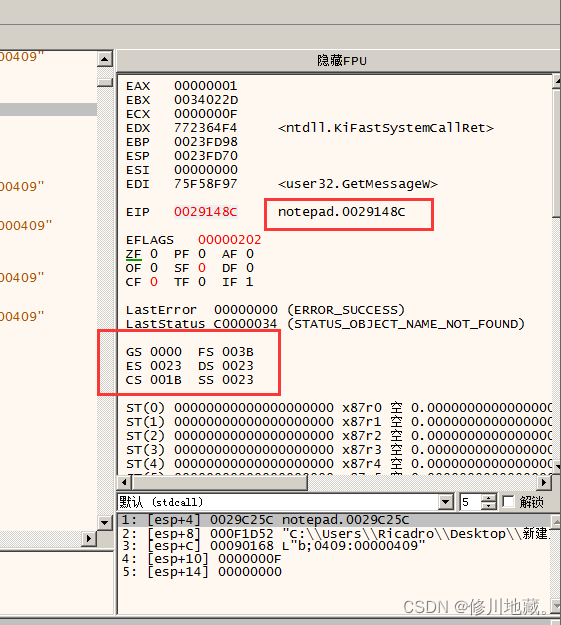
Parse the three segment registers:
```bash
CS Index: 0x3   TI: 0x0  CPL: 0x3
DS Index: 0x4   TI: 0x0  CPL: 0x3
SS Index: 0x4   TI: 0x0  CPL: 0x3
```
If TI is set, it means pointing to LDT (Local Descriptor Table), TI is reset, pointing to GDT (Global D escriptor Table )
Then display the GDT table data. The address of the Segment Descriptor pointed to by CS is GDTR Base + 8 * 3, and the address of the Segment Descriptor pointed to by DS and SS is GDTR Base + 8 * 4 .

---

# ananlysis
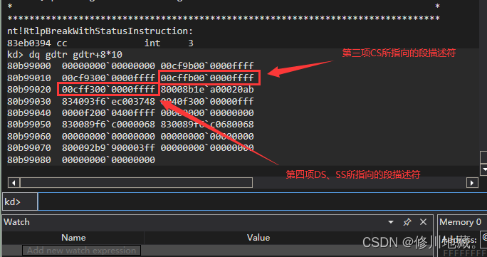
As shown in Figure 2, the value of the Segment Descriptor pointed to by CS is 0x00CFFB00~0000FFFF, and the values ​​pointed to by DS and SS are 0x00CFF300~0000FFFF.
The two segment descriptors are parsed according to the format in Figure 3. In 0x00CFFB00~0000FFFF:
```bash
Segment Limit 15:00 is 0xFFFF
Base  Address 15:00 is 0x0000
Base  Address 23:16 is 0x00
Type is 0xB (the specific meaning is shown in Figure 4)
S is 1 (not the system segment, but the CODE/DATA segment)
DPL is 3
P (1 means the segment exists in memory)
Segment Limit 19:16 is 0xF
AVL is 0  
L is 0 (not Long Mode)
D/B is 1 (32 bit segment)
Granularity is 1 (alignment granularity is PAGE)
Base Address 31:24 00
```
In summary: segment base address: 0x00000000
```bash
Segment boundary: 0xFFFFF
Alignment granularity: PAGE
```
The size of the segment: Limit * PAGE = 4G (for flat mode)
This section is the CODE section, and the attributes are readable, writable, and executable
This is a segment used by 32-bit programs and is a Ring3 code segment
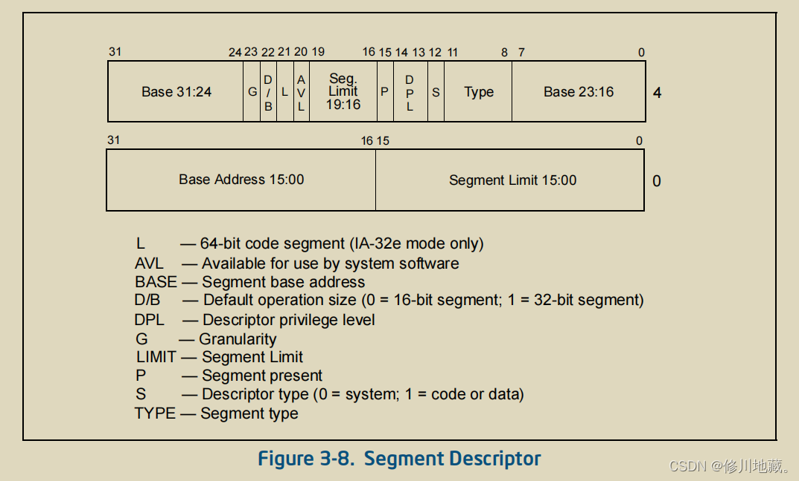
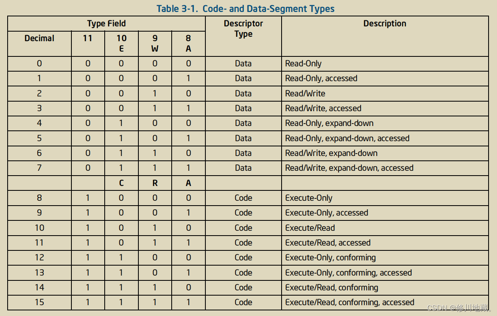
In addition to CODE Segment and DATA Segment, TSS Descriptor exists in the GDT table. The TR register stores the TSS Segment Selector. The segment descriptor is indexed in the GDT table through the Segment Selector. The TSS segment descriptor is slightly different from the above, the TSS segment descriptor in 32 -bit mode is shown in Figure 5:
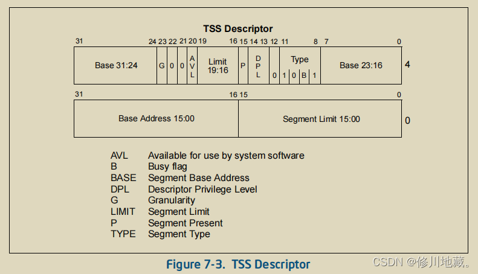
It is a bit simpler than the above descriptor, where the 9th bit of the Type member is the Busy bit, the task segment in use will set the Busy flag bit, and the others are 0. As shown in Figure 6, Figure 6 shows the state of the TSS segment in the Windows 7 7600 32- bit system, there are four TSS Descriptors , but only one TSS Descriptor's Busy bit is set.
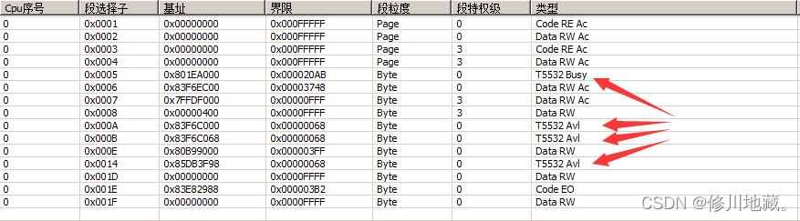
The Base Address in the TSS Descriptor points to the TSS ( Task State Segment ), and the structure is shown in Figure 7.
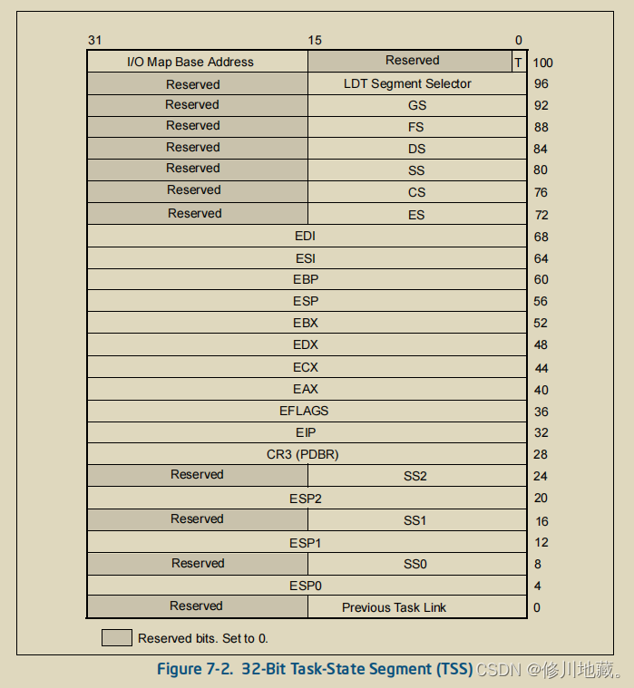
Above structure will update all fields after Task Switch.
In IA-32e mode,Windows is forced to be flat ( segment limit  is 0 ), 64 -bit registers are enough to index all addresses, so the Task Switch mechanism in IA-32e mode no longer needs TSS, but there must be a TSS . As shown in FIG. 8, the value of the 64 -bit program Segment Selector is in the IA-32e mode in the figure 8.
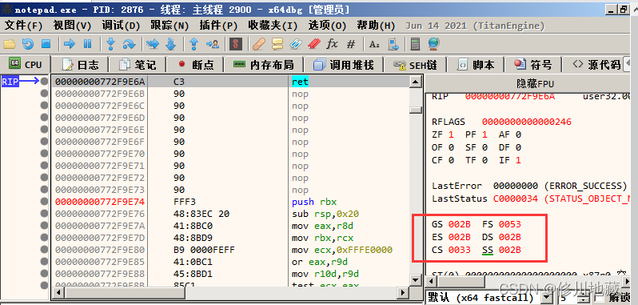
Index the Segment Descriptor in the GDT table , CS is the sixth item, and DS and SS are the fifth item, as shown in Figure 9:
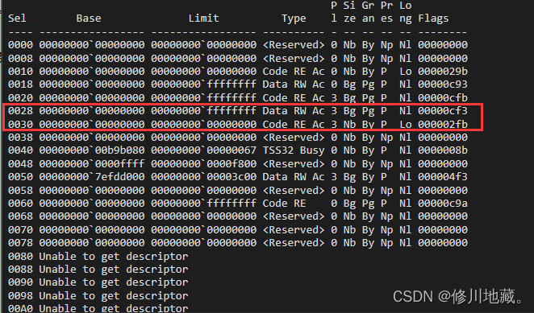
The CODE Segment used by the 64 -bit process is long mode, but the Stack Segment and DATA Segment  are not Long mode. However, it can be seen from Figure 9 that only Code Segment has Long mode, indicating that when Windows is compatible with 32-bit programs, 64-bit programs and 32 bits use the same DATA Segment and Stack Segment, but the Code Segment is different. Observing Figure 9, it can be seen that except for TSS, the descriptor segment limit of Long mode is 0, while the segment limit of non- Long mode is 4G. In IA-32e, the length of the TSS Descriptor descriptor is extended to 128Bit , other descriptor lengths and IA-32The pattern length is the same, both are 64 Bit. This leads to a TSS segment parsing error in Figure 9, so we need to manually parse the TSS descriptor. As shown in Figure 9, it is the IA-32e mode TSS Descriptor.
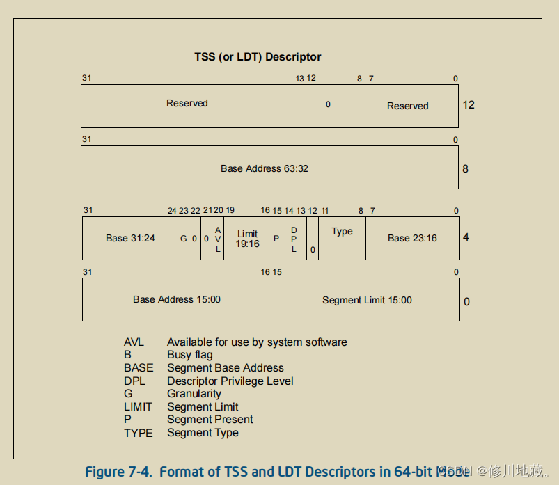
Read the value of TSS in GDT as shown in Figure 11:
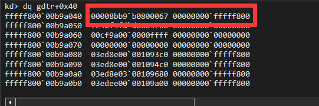
```bash
Base Address : 0xFFFFF800~00B9B080
Segment Limit : 0x067
Granularity : 0x0
```
Read the value of TSS, as shown in Figure 12:
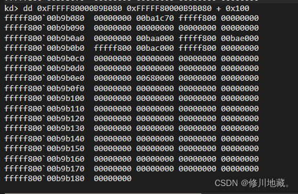
Figure 13 is TSS Format:
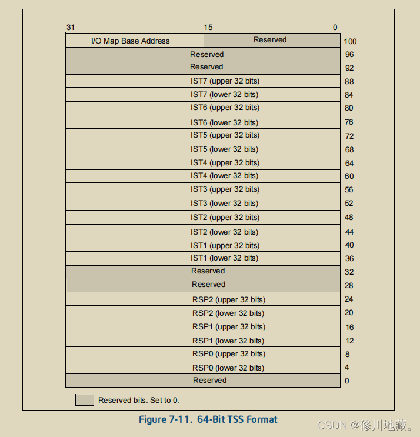
```bash
RSP0: 0xFFFFF800~00BA1C70
RSP1: 0x0
RSP2: 0x0
IST1: 0xFFFFF800~00BAA000
IST2: 0xFFFFF800~00BAE000
IST3: 0xFFFFF800~00BAC000
```
Then we read the IDT. Figure 14 is a part of the IDT. We observe that the No. 2 non-maskable interrupt Stack=0xFFFFF80000BAC000, the No.8 Double fault abort  Stack=0xFFFFF80000BAA000, and the No.12 McheckAbort interrupt Stack=0xFFFFF80000BAE000
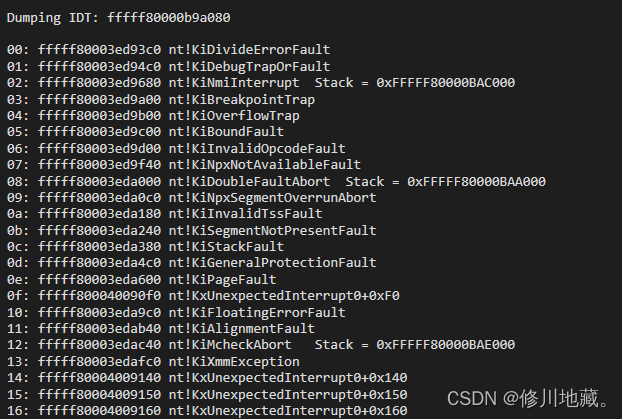
It can be seen that these interrupts are exceptions with relatively high IRQL, and this IST is specified in the IDT Gate Descriptor. As shown in Figure 15:
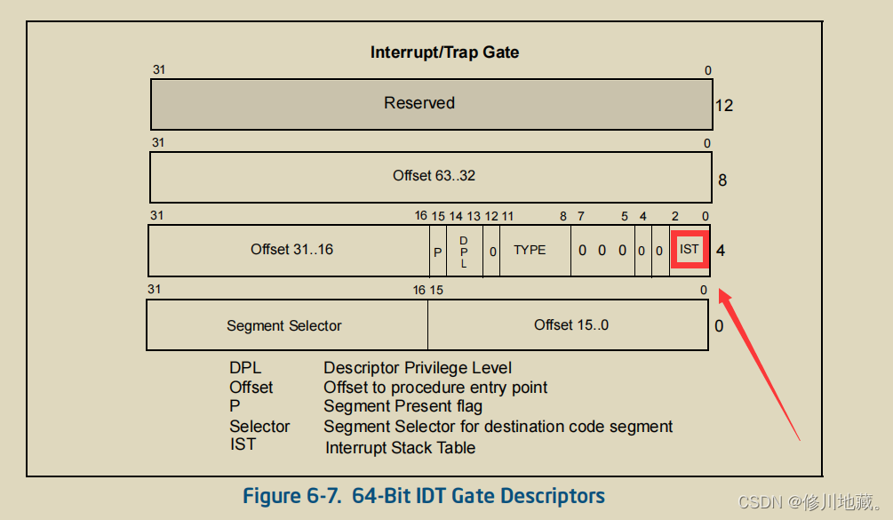
This is the use of Segment register in the Windows environment. The next article will introduce the use of Segment register in the RTOS environment.

**There are still many deficiencies in the learning process, and I hope friends can correct me!**

---

**Reference for this article: Intel® 64 and IA-32 Architectures Software Developer's Manual**
