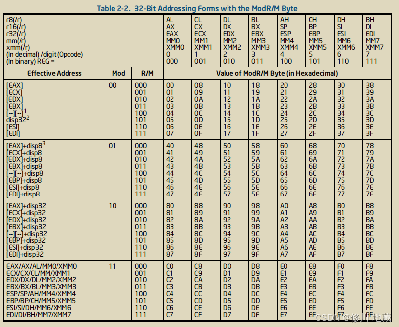

# x86 ISA
1. Command composition

It can be seen from Figure 1 that an x86 instruction can be divided into six parts: Instruction Prefixes, Opcode, Mod R/M, SIB, Displacement, and Immediate , among which Opcode is a mandatory part, and the others are optional parts.
2. Analysis of each part of the instruction
    1. Instruction Prefixes (optional part)
    The instruction prefix is ​​divided into four groups: Lock and repetition prefix, segment prefix, operand length modification prefix, and address length modification prefix.
        - Lock prefix: When the destination oprand is a memory operation, add the lock prefix before some specific instructions to ensure that it is an atomic operation. If it is not this part of the specific instruction, the execution will throw a #UD exception
        Cyclic prefix: add rep, repnz cyclic prefix before the movs instruction:
        ```bash 
        F0:8300 02	   lock add dword ptr ds:[eax],2	
        8300 02	       add dword ptr ds:[eax],2	
        F2:A4	       repne movsb 	
        F3:A4	       rep movsb 	
        ```
        - Segment prefix: used for memory access control.
        ```bash
        2E:C700 01000000	    mov dword ptr cs:[eax],1	
        3E:C701 01000000	    mov dword ptr ds:[ecx],1	
        26:C700 01000000	    mov dword ptr es:[eax],1	
        36:C700 01000000	    mov dword ptr ss:[eax],1	
        64:C700 01000000	    mov dword ptr fs:[eax],1	
        65:C700 01000000	    mov dword ptr gs:[eax],1	
        ```
        - Operand length modification prefix: used to modify the operand length
        ```bash
        C700 01000000	    mov dword ptr ds:[eax],1	
	    66:C700 0100	    mov word ptr ds:[eax],1	
        ```
        - Address length modification prefix
        ```bash
        2E:C700 01000000	mov dword ptr cs:[rax],1
        2E67:C700 01000000	mov dword ptr cs:[eax],1	
        ```
    2. opcode (mandatory part)
    Major opcodes may be one byte two bytes three bytes long. This field will determine whether the Mod R/M and SIB fields are present.
    3. Mod R/M (optional part)
    The Mod R/M field is ​​used to determine the address of the destination operand. It is divided into three parts: Mod, Reg, and R/M. The Mod field is ​​used to determine the address mode of the destination operand, and the Reg field is ​​used to determine the operation code of the instruction. The R/M field is ​​used to determine the address of the destination operand.
        > mod: Indicates that the operand in the opcode represents a register or memory, 11 represents memory, and the rest represent registers.
        ​​> ​​​​​​reg: Mark general-purpose registers.
        > r/m: If it is 100 , it has no effect, and in other cases it is the same as REX The common combination of PREFIX indicates the format of the address.
    Addressing method, if it is memory addressing, SIB field assistance is required.
    
    4. SIB (optional part)
    The SIB field is ​​used to determine the address of the destination operand. It is divided into three parts: Scale, Index, and Base. The Scale field is ​​used to determine the scale factor of the index register, and the Index field is ​​used to determine the index register. The Base field is ​​used to determine the base register.
    
    The three bytes of Scale and index, the 4 bits formed by the combination of the 1st bit (X) of REX PREFIX, and the 4 bits formed by the combination of modR/M and the 2nd bit (R) of REX PREFIX are determined together. The way to get the value by address.
    
    5. Displacement (optional part)
    This part of the field is the address shift length. The length can be 1 byte to 8 bytes and is an optional part.
    6. Immediate (optional part)
    This part represents the immediate value in the instruction, the length can be 1 byte to 8 bytes, and it is an optional part.

---

# ARM ISA
The ARM CPU has two operating states: arm and thumb. The CPU executes different instruction sets in different states. The mode is controlled by the T flag of the PSR register. The T flag is 0 to indicate the arm mode, and the length of the arm instruction is 4 bytes; 1 means thumb mode, the instruction length in thumb mode is 4byte or 2byte.
Since the ARM instruction is 2-byte aligned, the lowest bit of the memory must be an even number, and the LDR and BX instructions are used to perform branch and jump sums. There are two main ways for the CPU to perform branch jump and mode switching during operation. One is to use the LDR instruction to write the address in the memory into the PC register, and the lowest bit (lsb) of the jump address is 0 to switch to the arm mode. The minimum value is 1 to switch to thumb mode.
Next, this article will enumerate some differences between the x86 instruction set and the arm instruction set:
1. The difference in instruction length
The x86 instruction is a variable-length instruction, and the length of the arm instruction is 2byte or 4byte, so the operands in the arm instruction are all less than 32 bytes.
For example, the mov instruction assigns a 32-bit length number to the register:
```bash
X86：B8 44332211   mov eax,11223344
```
This is on an x86 machine, assigning a 32-bit value to a 32-bit register in 32-bit mode is hard-coded, B8 is the opcode, followed by the operand, and the instruction length is 5 bytes
```bash
Arm:    44 03 03 E3         MOVW  R0, #0x3344
        22 01 41 E3         MOVT  R0, #0x1122
```
Nex is an implementation in arm mode:
The first instruction is hardcoded as
```bash
1110  00110    0  00  0011   0000   001101000100
```
The encoding format of the first instruction is:

Among them, cond is a conditional judgment. In arm mode, general instructions will have conditional judgment. Thumb mode coding generally does not add execution judgment conditions. In this instruction, cond is 1110, which means unconditional execution, imm4 is 0011 è 0x3 Rd is 0, which means r0 register. imm12 is 001101000100 è 0x344 combined imm16 = imm4:imm12 is 0x3344
The second instruction is hardcoded as

In this instruction, cond is 1110 for unconditional execution, imm4 is 0001 è 0x1 Rd is 0 to indicate the r0 register, imm12 is 000100100010 è 0x122, the combination of imm16 = imm4:imm12 is 0x3344
It can be seen from the above that the first four digits of the instruction in the arm mode represent the judgment of the execution condition, followed by the hard code of the instruction, which is used to distinguish different instructions, and then followed by the register operand or register of the instruction, etc. .
2. Implicit operation register
There are no instructions for implicitly manipulating registers in the arm instruction set. For example, in x86, although the push pop instruction does not have the rsp register in the instruction, after the instruction is executed, the rsp register will be moved by default. However, there is no such instruction in arm, and the same function The instruction is expressed as 
```bash
push {r0}  STR R0,[SP,#-4]! 
pop  {r0}  LDR R0,[SP,# 4]!
```
3. Condition judgment
In the x86 instruction set, generally only the conditional jump will use the flag bit for branch jump, and in the arm instruction set, the first four bits of the instruction in the arm mode are all for execution condition judgment, and the flag bit will be used.
The following figure shows the conditional judgment in the x86 instruction set:

The following figure shows the conditional judgment in the arm instruction set:

In the rflags register in the x86 instruction set and the CF, ZF, SF, and OF flags in the eflags register in the PSR register in the arm instruction set correspond to C, Z, N, and V in the arm, respectively, which are the carry and borrow flags (unsigned number Use), 0 flag, positive and negative flag, and overflow flag (used for signed numbers), where the CF flag of x86 is different from the C flag in arm. In x86, regardless of addition and subtraction, borrow and carry It is 1, and it is 0 if there is no borrow . In arm  , for addition, if a carry is generated, then C=1; otherwise, C=0 . For subtraction, if a borrow is generated, then C=0; otherwise, C=1 . That is, addition in x86 and arm has the same effect on the CF and C flags, and subtraction has the opposite effect on them.


So the above difference leads to the fact that the establishment condition of ja in the x86 instruction set is (CF or ZF) = 0, while the same unsigned integer HI establishment condition C == 1 and Z == 0 in the arm instruction set is different, and the same The conditions of jbe in the x86 instruction set and the corresponding LS in the arm instruction set are also different.
Most of the content of the article comes from:
**There are still many deficiencies in the learning process, and I hope friends can correct me!**

---

**Arm Architecture Reference Manual for A-profile architecture**
**Intel® 64 and IA-32 Architectures Software Developer's Manual**
